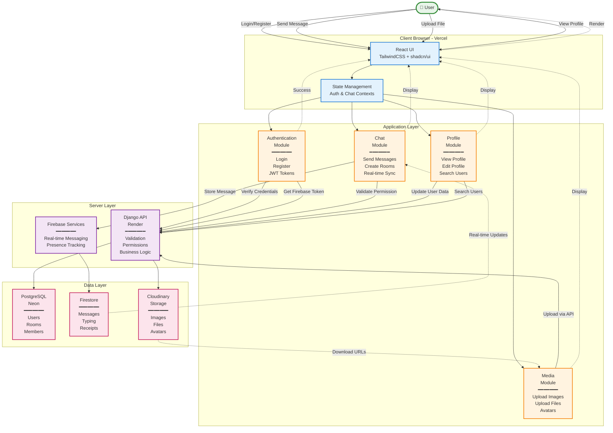
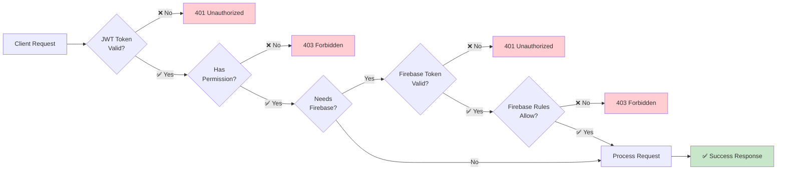

# FlowChat - System Architecture

A simple, user-centric view of the FlowChat system architecture.

---

## System Architecture - User Perspective



---

## Key Data Flows

### 🔐 User → Auth: Login
```
User enters credentials → React UI → Django API → PostgreSQL (verify) 
→ Django generates JWT + Firebase token → React stores tokens → User authenticated
```

### 💬 User → Chat: Send Message
```
User types message → React UI → Django API (validate permission) → PostgreSQL (check membership)
→ Firebase Firestore (store message) → Real-time sync → All users see message
```

### 📁 User → Media: Upload File
```
User selects file → React UI → Firebase Storage (direct upload) → Storage returns URL
→ Firestore (create message with URL) → Real-time sync → All users see file
```

### 👤 User → Profile: View/Edit
```
User requests profile → React UI → Django API → PostgreSQL (fetch/update user data)
→ Django returns data → React displays profile
```

---

## Key Architecture Principles

### 🔐 Authentication Strategy
- **Primary Auth**: Django JWT tokens for API access
- **Firebase Auth**: Custom tokens for Firebase SDK operations
- **Dual Token System**: Both issued on login for seamless access

### 💬 Message Handling
- **Validation**: Django checks permissions via PostgreSQL
- **Storage**: Messages stored in Firestore for real-time sync
- **Delivery**: Firebase SDK listeners for instant updates

### 📁 File Management
- **Uploads**: Client → Django API → Cloudinary
- **URL Storage**: Cloudinary URLs stored in Firestore messages/PostgreSQL profile fields
- **Efficient**: Offloads large media to Cloudinary CDN

### 👥 Presence System
- **Real-time**: Firebase RTDB for online/offline status
- **Multi-session**: Supports multiple tabs/devices per user
- **Auto-cleanup**: onDisconnect() handles unexpected disconnects

### 🔔 Notifications
- **WebSocket**: Django Channels for instant notifications
- **Redis**: Message broker for pub/sub pattern
- **Use Cases**: Room created, member added, system alerts

---

## Technology Stack Summary

| Layer | Technology | Purpose |
|-------|------------|---------|
| **Frontend** | React + TailwindCSS + shadcn/ui | User interface and interactions |
| **Backend API** | Django + Django REST Framework | Authentication, validation, business logic |
| **WebSocket** | Django Channels + Redis | Real-time notifications |
| **Primary DB** | PostgreSQL (Neon) | Users, rooms, memberships, permissions |
| **Real-time Messages** | Firebase Firestore | Chat messages, typing, read receipts |
| **Presence** | Firebase RTDB | Online/offline status tracking |
| **File Storage** | Cloudinary | Images, files, avatars |
| **Hosting** | Vercel + Render + Neon | Frontend, backend, database |

---

## Data Storage Strategy

### PostgreSQL (Neon) - Structured Data
```
✓ User accounts and authentication
✓ Chat room metadata (name, type, avatar)
✓ Room memberships and roles
✓ Permissions and access control
✓ Optional message metadata
```

### Firebase Firestore - Real-time Data
```
✓ Chat messages (chat_rooms_{roomId})
✓ Typing indicators (typing_{roomId})
✓ Read receipts (read_receipts_{roomId}_{messageId})
✓ Real-time synchronization across clients
```

### Firebase RTDB - Presence Data
```
✓ Online/offline status (status/{uid})
✓ Multi-session tracking (connections/{sessionId})
✓ Last seen timestamps
✓ Automatic disconnect handling
```

### Cloudinary - Media Files
```
✓ Profile pictures (profile_pictures/{userId}/)
✓ Chat images (chat_images/{roomId}/)
✓ File attachments (chat_files/{roomId}/)
✓ Group avatars (group_avatars/{roomId}/)
```

---

## Security Architecture



**Security Layers:**
1. JWT authentication for all Django API calls
2. Firebase token validation for Firebase operations
3. Permission checks against PostgreSQL
4. Firebase security rules for Firestore/Storage/RTDB
5. CORS restrictions to allowed domains

---

## Request Flow Examples

### Example 1: User Sends a Message
```
User types → React validates → Django API (check permission) → 
PostgreSQL (verify membership) → Firestore (write message) → 
Firebase SDK (real-time sync) → All clients display message
```

### Example 2: User Uploads Image
```
User selects image → React → Firebase Storage (direct upload) → 
Storage returns URL → Firestore (create message with URL) → 
Firebase SDK (real-time sync) → All clients display image
```

### Example 3: User Logs In
```
User enters credentials → React → Django API (verify) → 
PostgreSQL (check user) → Django (generate JWT + Firebase token) → 
React (store JWT) → Firebase SDK (sign in) → User authenticated
```

### Example 4: User Goes Online
```
User opens app → React → Firebase RTDB (write presence) → 
RTDB (register onDisconnect) → Real-time sync → 
All clients see user online
```

---

## Performance Optimizations

### Frontend
- React Context for state management
- Firebase SDK listeners for real-time updates
- Lazy loading of components
- Image optimization before upload

### Backend
- JWT stateless authentication
- Redis caching for WebSocket channels
- Database connection pooling (Neon)
- Async operations with Django Channels

### Database
- PostgreSQL indexes on frequently queried fields
- Firestore composite indexes for complex queries
- RTDB presence with automatic cleanup
- Cloudinary CDN for media delivery

---

## Scalability Considerations

### Horizontal Scaling
- **Frontend**: Vercel CDN (automatic)
- **Backend**: Multiple Render instances behind load balancer
- **Database**: Neon auto-scaling
- **Firebase**: Automatic scaling (managed service)

### Vertical Scaling
- **Redis**: Upgrade plan for more connections
- **PostgreSQL**: Increase compute/storage on Neon
- **Backend**: Increase Render instance size

### Caching Strategy
- JWT tokens cached in localStorage
- User profiles cached in React Context
- Redis for WebSocket message routing
- Firebase SDK handles Firestore caching

---

*FlowChat - Modern Real-time Chat Architecture*
