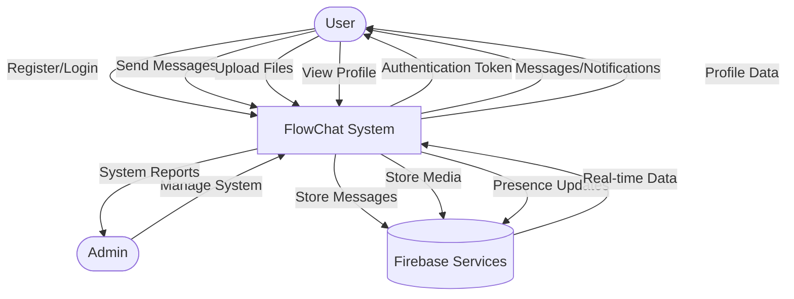
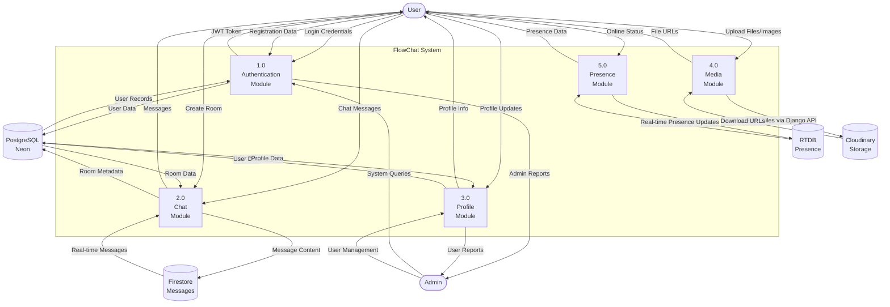
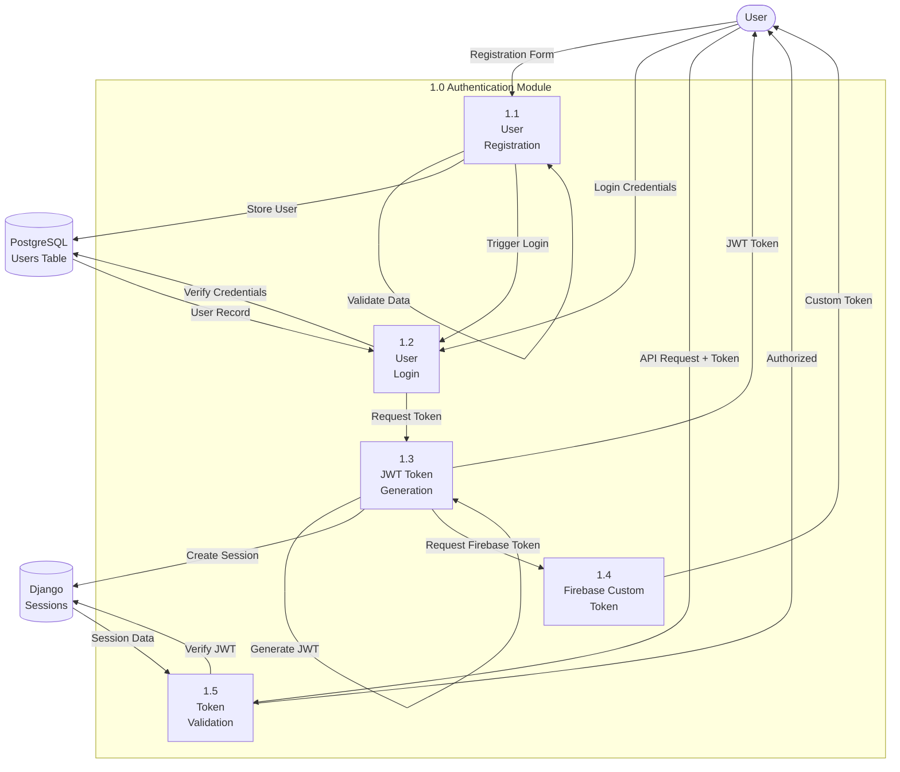
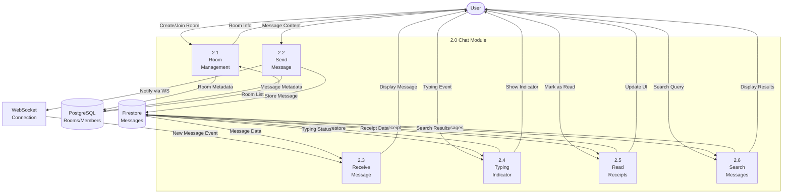
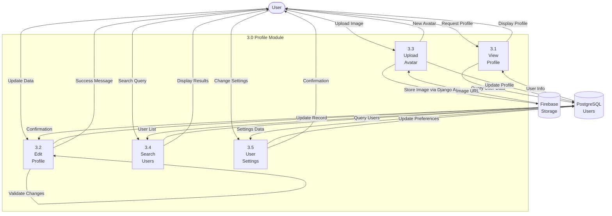
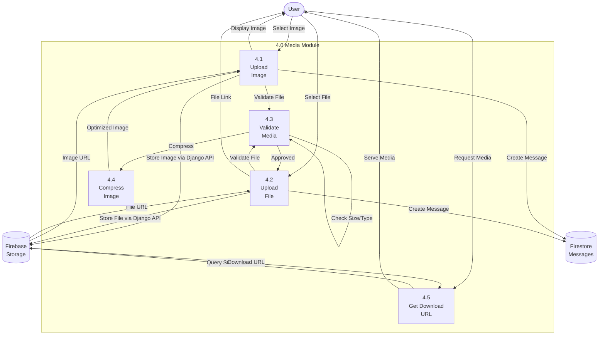

# FlowChat - Data Flow Diagrams (DFD)

This document contains Data Flow Diagrams for the FlowChat application at different levels of abstraction.

---

## Level 0 DFD (Context Diagram)

The context diagram shows the FlowChat system as a single process with external entities.



**External Entities:**
- **User**: End users who chat, send messages, and manage profiles
- **Admin**: System administrators who manage the application
- **Firebase Services**: External cloud services for real-time messaging, storage, and presence

**Data Flows:**
- User authentication and registration
- Message exchange and file uploads
- Profile management
- Real-time notifications and presence updates

---

## Level 1 DFD

Level 1 breaks down the FlowChat system into major subsystems.



**Major Processes:**
1. **Authentication Module (1.0)**: Handles user registration, login, JWT token generation
2. **Chat Module (2.0)**: Manages chat rooms, messages, typing indicators, read receipts
3. **Profile Module (3.0)**: User profile management, search, settings
4. **Media Module (4.0)**: File and image uploads, storage management
5. **Presence Module (5.0)**: Online/offline status, last seen tracking

**Data Stores:**
- **PostgreSQL (Neon)**: User accounts, room metadata, memberships
- **Firestore**: Chat messages, typing indicators, read receipts
- **RTDB**: Real-time presence and online status
- **Cloudinary**: Images, files, avatars

---

## Level 2 DFD - Authentication Module (1.0)

Detailed breakdown of the Authentication Module.



**Sub-processes:**
- **1.1 User Registration**: Validates and creates new user accounts
- **1.2 User Login**: Authenticates users against stored credentials
- **1.3 JWT Token Generation**: Creates JWT tokens for API access
- **1.4 Firebase Custom Token**: Generates Firebase tokens for client SDK
- **1.5 Token Validation**: Validates tokens on protected endpoints

---

## Level 2 DFD - Chat Module (2.0)

Detailed breakdown of the Chat Module.



**Sub-processes:**
- **2.1 Room Management**: Create, join, leave rooms; manage members
- **2.2 Send Message**: Process and store outgoing messages
- **2.3 Receive Message**: Handle incoming messages via WebSocket
- **2.4 Typing Indicator**: Real-time typing status updates
- **2.5 Read Receipts**: Track and display message read status
- **2.6 Search Messages**: Query and retrieve message history

---

## Level 2 DFD - Profile Module (3.0)

Detailed breakdown of the Profile Module.



**Sub-processes:**
- **3.1 View Profile**: Display user profile information
- **3.2 Edit Profile**: Update user details (name, bio, etc.)
- **3.3 Upload Avatar**: Handle profile picture uploads
- **3.4 Search Users**: Find users by username or email
- **3.5 User Settings**: Manage preferences and privacy settings

---

## Level 2 DFD - Media Module (4.0)

Detailed breakdown of the Media Module.



**Sub-processes:**
- **4.1 Upload Image**: Handle image uploads to chat
- **4.2 Upload File**: Handle document/file uploads
- **4.3 Validate Media**: Check file size, type, and permissions
- **4.4 Compress Image**: Optimize images before storage
- **4.5 Get Download URL**: Retrieve signed URLs for media access

---

## Level 2 DFD - Presence Module (5.0)

Detailed breakdown of the Presence Module.

```mermaid
graph TB
    User([User])
    
    subgraph Presence_Module[5.0 Presence Module]
        Connect[5.1<br/>Connect<br/>Session]
        UpdateStatus[5.2<br/>Update<br/>Status]
        Disconnect[5.3<br/>Handle<br/>Disconnect]
        Subscribe[5.4<br/>Subscribe to<br/>Presence]
        LastSeen[5.5<br/>Update<br/>Last Seen]
    end
    
    RTDB[(Firebase RTDB<br/>status/{uid})]
    PostgresDB[(PostgreSQL<br/>Users)]
    
    User -->|Login/Connect| Connect
    Connect -->|Create Session| RTDB
    Connect -->|Register onDisconnect| RTDB
    RTDB -->|Session ID| Connect
    Connect -->|Online Status| User
    
    User -->|Activity| UpdateStatus
    UpdateStatus -->|Write Status| RTDB
    UpdateStatus -->|Timestamp| RTDB
    RTDB -->|Confirmation| UpdateStatus
    
    User -->|Close Tab/Logout| Disconnect
    Disconnect -->|Trigger onDisconnect| RTDB
    RTDB -->|Remove Session| RTDB
    RTDB -->|Update Last Seen| LastSeen
    LastSeen -->|Store Timestamp| PostgresDB
    
    User -->|View Chat| Subscribe
    Subscribe -->|Listen to Status| RTDB
    RTDB -->|Presence Updates| Subscribe
    Subscribe -->|Display Status| User
    
    RTDB -->|Last Changed| LastSeen
    LastSeen -->|Update DB| PostgresDB
```

**Sub-processes:**
- **5.1 Connect Session**: Establish presence tracking on user login
- **5.2 Update Status**: Real-time online/offline status updates
- **5.3 Handle Disconnect**: Cleanup on unexpected disconnects
- **5.4 Subscribe to Presence**: Listen to other users' presence
- **5.5 Update Last Seen**: Track and store last activity timestamp

---

## Data Store Details

### PostgreSQL (Neon)
- **users**: User accounts, credentials, profile data
- **chat_rooms**: Room metadata, type (direct/group), avatar
- **chat_room_members**: Membership, roles (admin/member), join dates
- **message_metadata**: Optional message references, types
- **django_session**: Active sessions

### Firebase Firestore
- **chat_rooms_{roomId}**: Messages per room
- **typing_{roomId}**: Typing indicators per room
- **read_receipts_{roomId}_{messageId}**: Read receipts per message

### Firebase RTDB
- **status/{uid}/connections/{sessionId}**: Multi-session presence tracking
- **status/{uid}/state**: Online/offline state (legacy)
- **status/{uid}/last_changed**: Last activity timestamp

### Cloudinary Storage
- **chat_images/{roomId}**: Chat image uploads
- **chat_files/{roomId}**: Chat file uploads
- **profile_pictures/{userId}**: User profile pictures
- **group_avatars/{roomId}**: Group chat avatars

---

## Key Data Flows Summary

1. **Authentication Flow**: User → Django → PostgreSQL → JWT → Firebase Custom Token
2. **Message Flow**: User → Django API → Firestore → WebSocket → Other Users
3. **Media Flow**: User → Firebase Storage → Download URL → Firestore Message
4. **Presence Flow**: User → Firebase RTDB → Real-time Listeners → UI Updates
5. **Profile Flow**: User → Django API → PostgreSQL → Response

---

## Technology Mapping

- **Frontend**: React.js (handles user interactions and displays)
- **Backend API**: Django + DRF (processes 1.0-3.0, 4.0 validation)
- **WebSocket**: Django Channels + Redis (real-time notifications)
- **Database**: PostgreSQL on Neon (structured data storage)
- **Real-time DB**: Firebase Firestore + RTDB (messages and presence)
- **Storage**: Cloudinary (media files)
- **Hosting**: Vercel (frontend), Render (backend), Neon (database)

---

*Generated for FlowChat - Real-Time Chat Application*
