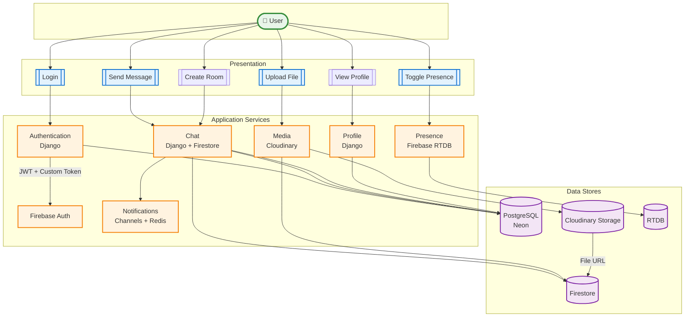

# FlowChat - Simple Architecture Diagram

A clean, user-centric view of how data flows through FlowChat.

---

## System Data Flow

---

## Key Data Flows

**User → Auth:** Login Credentials  
**Auth → Postgres:** Verify User  
**Auth → User:** JWT + Firebase Token  

**User → Chat:** Send Message  
**Chat → Postgres:** Validate Permission  
**Chat → Firestore:** Store Message  
**Firestore → User:** Real-time Sync  

**User → Media:** Upload File  
**Media → Storage:** Store File  
**Storage → Firestore:** File URL  
**Firestore → User:** Display Media  

**User → Presence:** Online Status  
**Presence → Firestore:** Write Status  
**Firestore → User:** Show Status  

---

## System Components

### 🔐 Authentication System
- **Technology**: Django + PostgreSQL (Neon)
- **Function**: Verify credentials, generate JWT and Firebase tokens
- **Data**: User accounts, passwords, sessions

### 💬 Chat System
- **Technology**: Django + Firebase Firestore
- **Function**: Validate permissions, store messages, real-time sync
- **Data**: Messages, typing indicators, read receipts

### 📁 Media System
- **Technology**: Cloudinary
- **Function**: Store and serve files, images, avatars
- **Data**: Profile pictures, chat images, file attachments

### 👥 Presence System
- **Technology**: Firebase RTDB
- **Function**: Track online/offline status in real-time
- **Data**: User presence, last seen, active sessions

---

## Data Storage

| Database | What It Stores | Why |
|----------|----------------|-----|
| **PostgreSQL (Neon)** | Users, Rooms, Members, Permissions | Structured relational data |
| **Firestore** | Messages, Typing, Read Receipts | Real-time synchronization |
| **Cloudinary Storage** | Images, Files, Avatars | Large binary files |
| **RTDB** | Online Status, Presence | Real-time presence tracking |

---

## Technology Stack

**Frontend**: React + TailwindCSS + shadcn/ui (Vercel)  
**Backend**: Django + Django REST Framework (Render)  
**Database**: PostgreSQL (Neon)  
**Real-time**: Firebase (Firestore + RTDB)  
**WebSocket**: Django Channels + Redis  

---

*FlowChat - Simple, Fast, Real-time*
