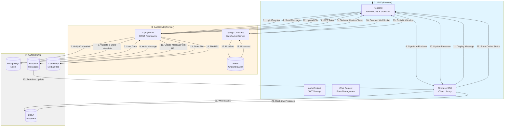
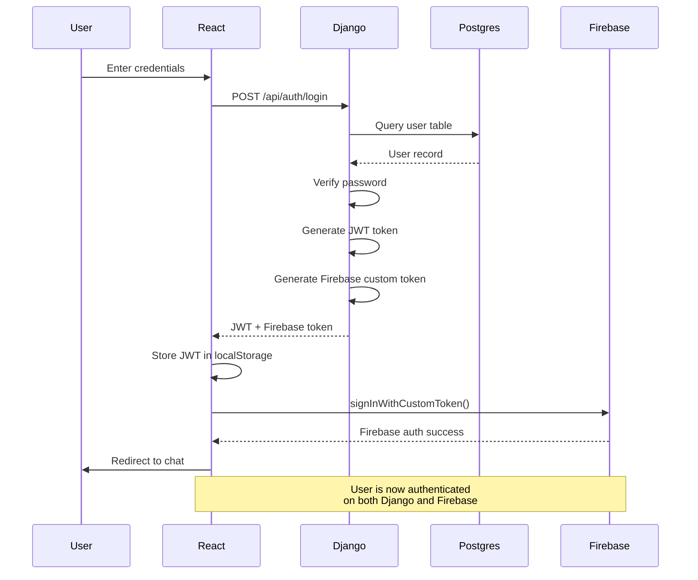
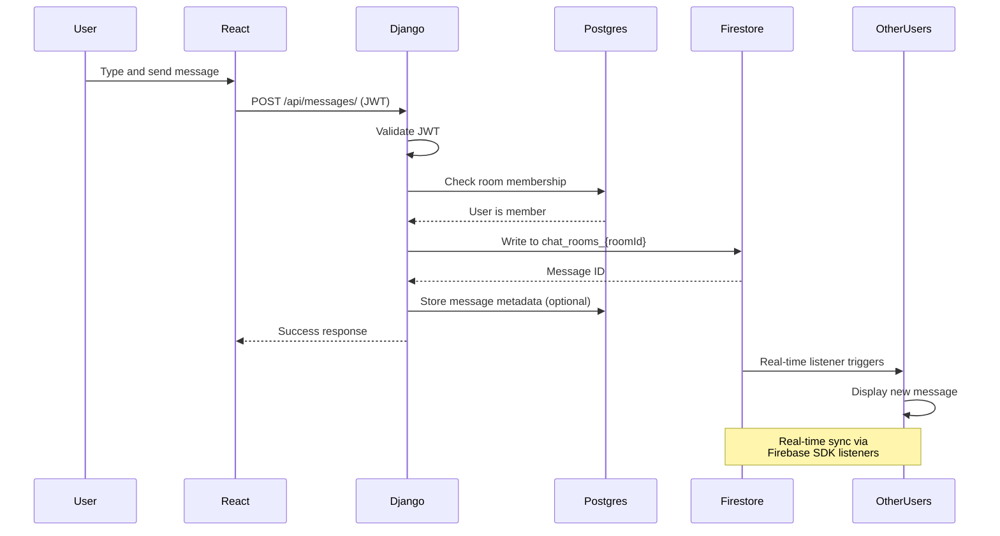
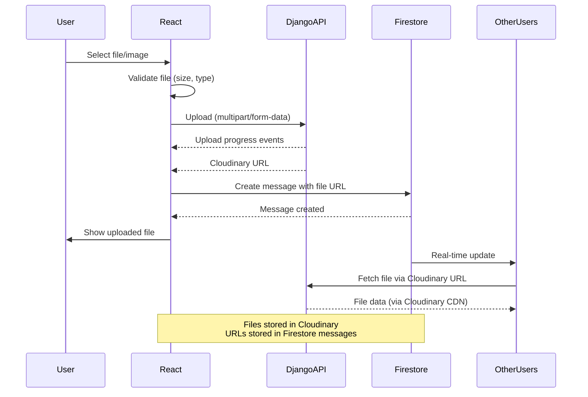
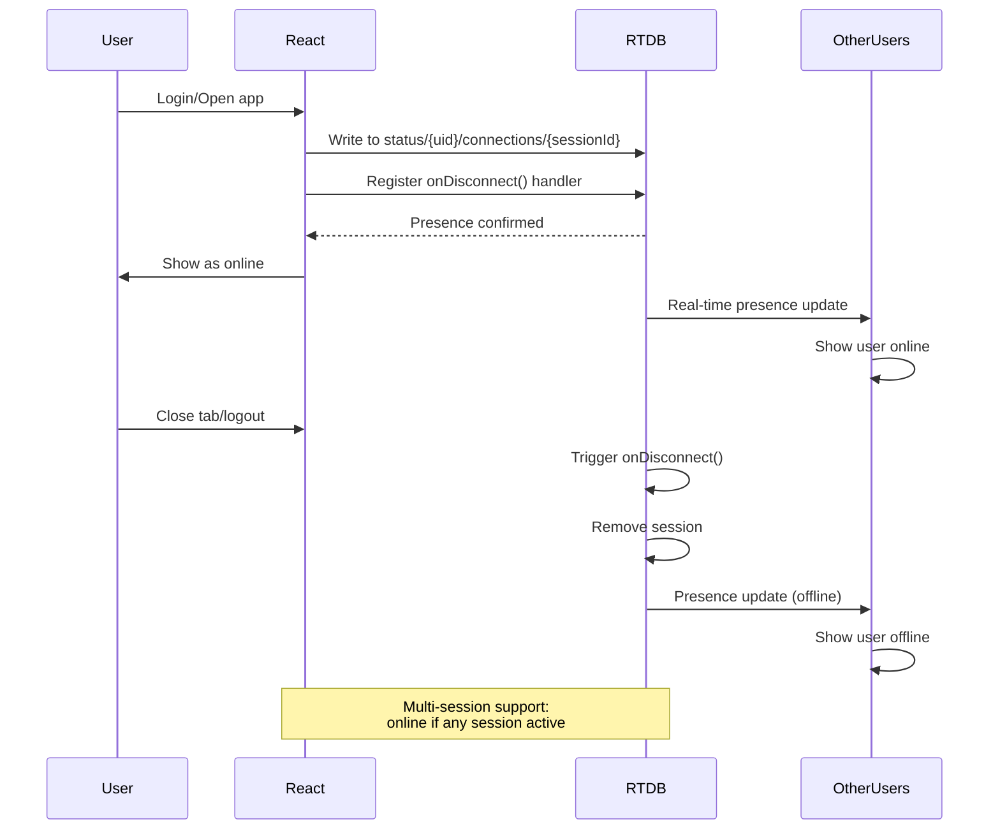
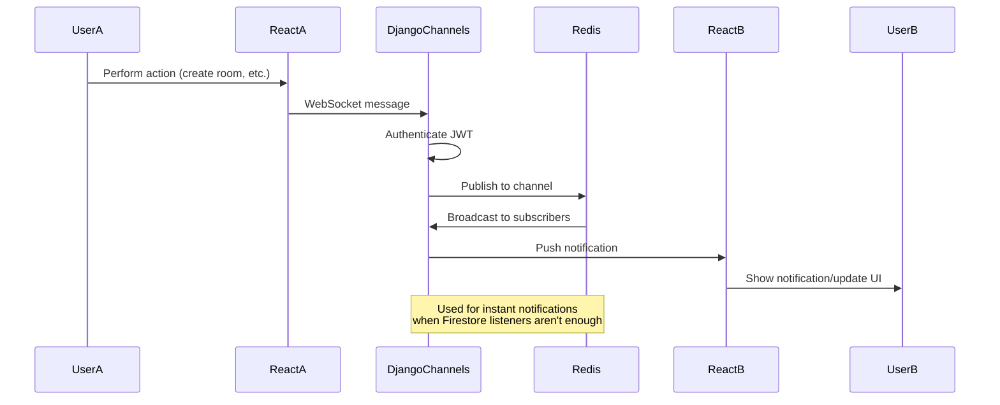
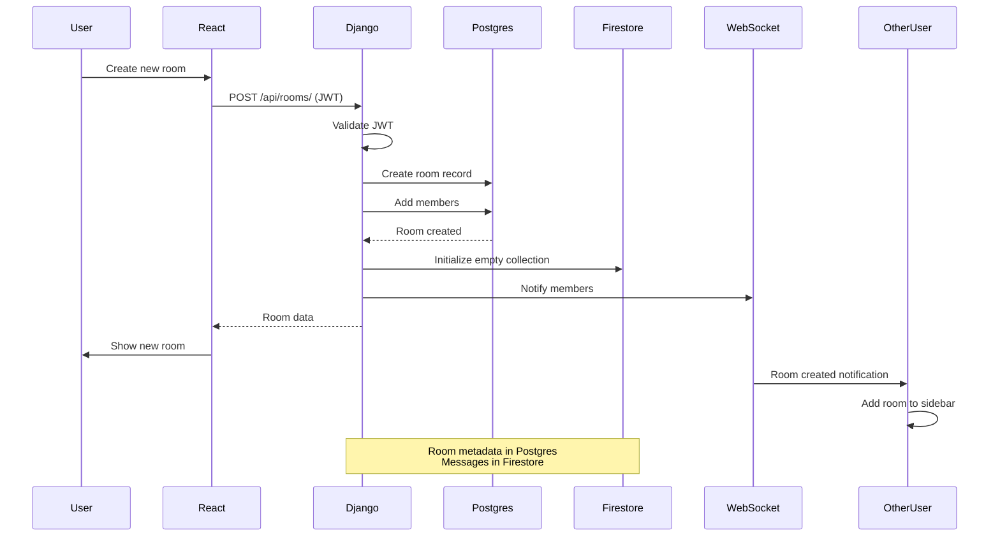
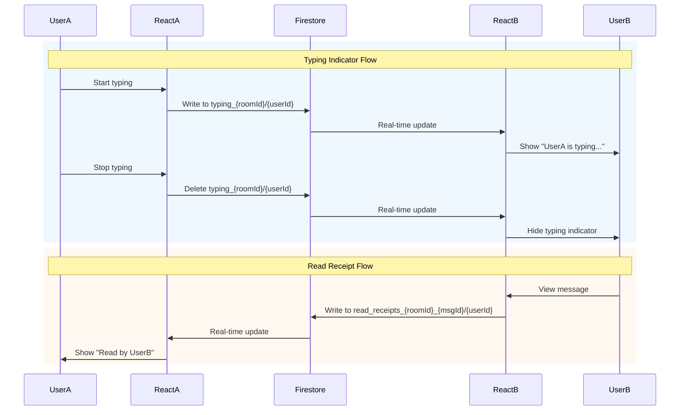
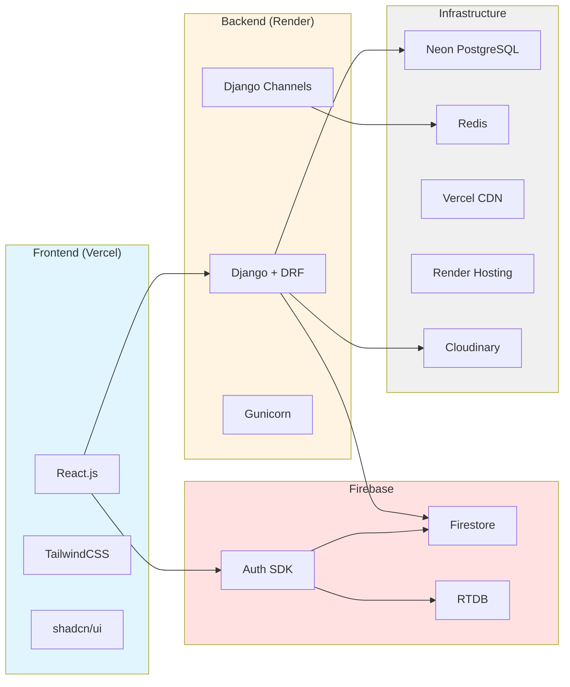
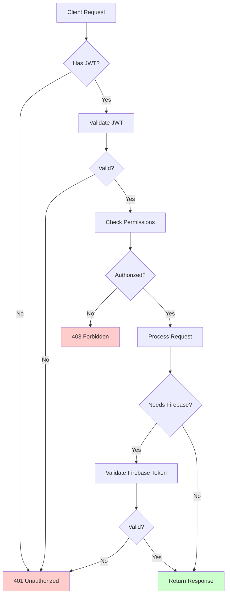

# FlowChat - System Data Flow Diagram

A simple visual guide showing how data flows through the FlowChat application.

---

## Complete System Architecture Flow



---

## 1️⃣ Authentication Flow



**Key Points:**
- Django handles primary authentication
- JWT token for Django API calls
- Firebase custom token for Firebase SDK access
- Both tokens issued simultaneously

---

## 2️⃣ Send Message Flow



**Key Points:**
- Django validates permissions
- Message content stored in Firestore
- Real-time delivery via Firebase listeners
- Optional metadata in PostgreSQL

---

## 3️⃣ File Upload Flow



**Key Points:**
- Direct upload to Cloudinary via Django API
- No Firebase involvement (reduces backend load)
- Download URLs stored in message documents
- Real-time file sharing

---

## 4️⃣ Real-time Presence Flow



**Key Points:**
- Firebase RTDB for real-time presence
- Multi-session tracking (multiple tabs/devices)
- Automatic offline on disconnect
- No Django involvement

---

## 5️⃣ WebSocket Notification Flow



**Key Points:**
- Django Channels for WebSocket connections
- Redis as message broker
- Real-time notifications (room created, member added, etc.)
- Complements Firebase real-time features

---

## 6️⃣ Create Chat Room Flow



**Key Points:**
- Room metadata in PostgreSQL (Neon)
- Members and permissions in PostgreSQL
- Message collection initialized in Firestore
- WebSocket notifies other members

---

## 7️⃣ Read Receipts & Typing Indicators



**Key Points:**
- All handled by Firestore (no Django)
- Real-time updates via Firebase SDK
- Typing: temporary documents
- Read receipts: permanent documents

---

## Data Storage Summary

| Data Type | Storage Location | Why |
|-----------|------------------|-----|
| **User accounts** | PostgreSQL (Neon) | Structured, relational data |
| **Room metadata** | PostgreSQL (Neon) | Relationships, permissions |
| **Room members** | PostgreSQL (Neon) | Many-to-many relationships |
| **Chat messages** | Firestore | Real-time sync, scalability |
| **Typing indicators** | Firestore | Real-time, temporary |
| **Read receipts** | Firestore | Real-time, per-message |
| **Online status** | RTDB | Real-time presence |
| **Images/Files** | Cloudinary | Large binary files |
| **Profile pictures** | Cloudinary | Media files |
| **WebSocket sessions** | Redis | Temporary, fast pub/sub |

---

## Technology Stack Map



---

## Request Flow Examples

### Example 1: User sends a text message
1. User types in React UI
2. React → Django API (validate permission)
3. Django → PostgreSQL (check membership)
4. Django → Firestore (write message)
5. Firestore → All clients (real-time update)
6. React displays message

### Example 2: User uploads an image
1. User selects image in React
2. React → Django API (validate and upload)
3. Django → Cloudinary (store file)
4. Cloudinary → Django (download URL)
5. Django → Firestore (message with image URL)
6. Firestore → All clients (real-time update)
7. Clients fetch image from Cloudinary URL

### Example 3: User goes online
1. User logs in
2. React → Firebase RTDB (write presence)
3. RTDB registers onDisconnect handler
4. RTDB → All subscribers (real-time presence)
5. Other users see "online" status

### Example 4: User searches for another user
1. User types in search box
2. React → Django API (search query)
3. Django → PostgreSQL (query users table)
4. PostgreSQL → Django (matching users)
5. Django → React (user list)
6. React displays results

---

## Security Flow



**Security Layers:**
1. **JWT Authentication**: All Django API requests
2. **Firebase Authentication**: All Firebase SDK operations
3. **Permission Checks**: Room membership, ownership
4. **Firebase Rules**: Firestore, Storage, RTDB security rules
5. **CORS**: Restrict origins to Vercel domain

---

## Summary: Data Flow Patterns

### Pattern 1: Django-First (Structured Data)
**User Management, Room Metadata, Permissions**
```
Client → Django API → PostgreSQL → Django → Client
```

### Pattern 2: Firebase-First (Real-time Data)
**Messages, Typing, Presence**
```
Client → Firebase SDK → Firestore/RTDB → Firebase SDK → All Clients
```

### Pattern 3: Hybrid (Validation + Real-time)
**Send Message, Create Room**
```
Client → Django (validate) → PostgreSQL + Firestore → Firebase SDK → All Clients
```

### Pattern 4: Direct Upload (Media)
**Images, Files, Avatars**
```
Client → Firebase Storage → Download URL → Firestore → All Clients
```

---

*FlowChat - Simple, Fast, Real-time*
